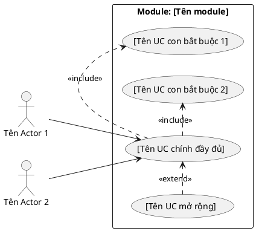
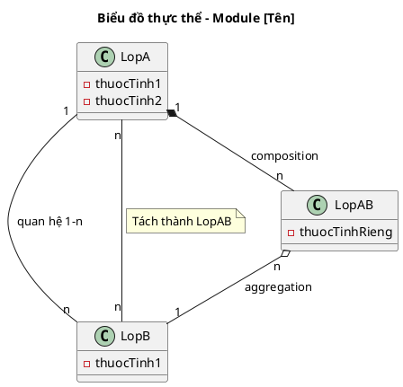
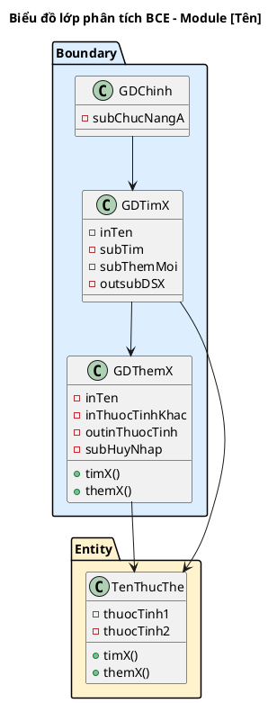
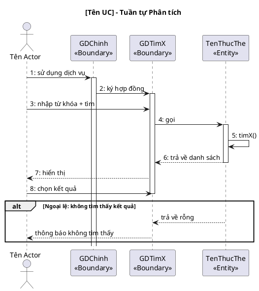
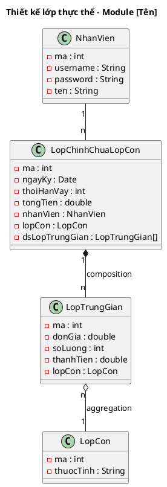
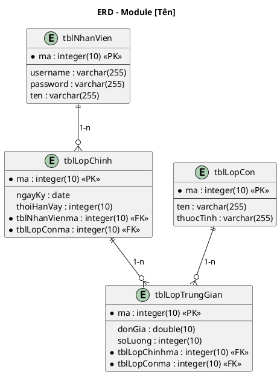
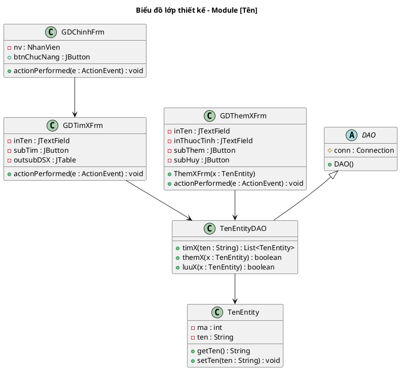
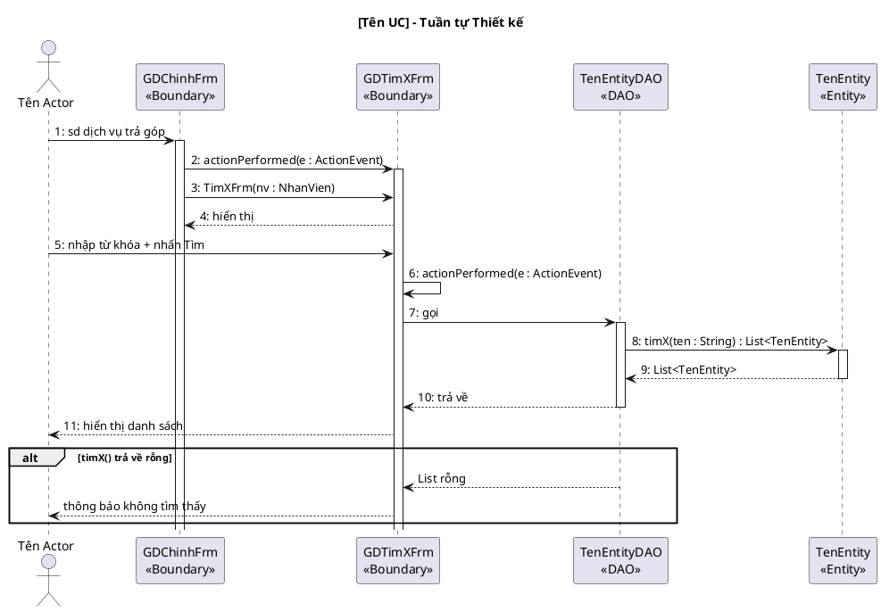

# 4 Pha – Tài liệu từng Module

Mỗi module cần sinh đủ 10 mục theo thứ tự. Kết quả pha trước là đầu vào bắt buộc cho pha sau.

---

## Quy tắc style chung cho MỌI biểu đồ (BẮT BUỘC)

Áp dụng cho toàn bộ biểu đồ trong tài liệu module: UC, lớp, tuần tự, ERD.

1. **Dàn bố cục trên nhiều dòng:** Khi có nhiều package / module / nhóm, xếp theo chiều dọc (top-to-bottom) hoặc dạng lưới. KHÔNG đặt tất cả trên một hàng ngang. Các module phải được xác định trong plan từ đầu.

2. **Không viết tắt tên, giữ mã UC xuyên suốt:**
   - Tên hiển thị trong biểu đồ PHẢI đầy đủ, KHÔNG viết tắt.
   - Mã UC (UC01, UC02...) từ biểu đồ tổng quan hệ thống PHẢI được giữ nguyên khi mang sang biểu đồ chi tiết module. Không đổi sang alias khác (VD: không dùng `UC_main`, `UC_sub1` thay cho `UC01`, `UC02`).

3. **Mũi tên thẳng, phần tử dàn đều:**
   - Tất cả mũi tên PHẢI thẳng (`-->`, `.<...>>`), KHÔNG dùng mũi tên chéo.
   - Dàn đều các phần tử trong mỗi package / nhóm, không để chồng chéo hoặc quá gần nhau.
   - Dùng `top to right direction` hoặc `left to right direction` để điều hướng mũi tên.

---

## PHA 1: LUỒNG XÁC ĐỊNH YÊU CẦU

### Mục 1 – Biểu đồ Use Case chi tiết của module

**Quy trình 3 bước (BẮT BUỘC thực hiện và trình bày):**

- **Bước 1:** Copy các UC + actor liên quan từ UC tổng quan của hệ thống vào phạm vi module.
- **Bước 2:** Mỗi giao diện chính trong module → đề xuất thành 1 UC con.
- **Bước 3:** Xem xét quan hệ giữa từng UC con với UC chính:
  - `<<include>>` nếu UC con là bước BẮT BUỘC trong UC chính.
  - `<<extend>>` nếu UC con chỉ xảy ra trong một số điều kiện nhất định.

**Kèm mô tả từng UC bằng văn xuôi** (ví dụ: "UC 'Tìm kiếm khách hàng': UC này cho phép UC [chính] tìm khách hàng")



**Lưu ý:** Mã UC (UC01, UC02...) PHẢI khớp chính xác với bảng UC tổng quan ở giai đoạn 1. Khi copy UC sang biểu đồ chi tiết module, giữ nguyên mã, không đổi alias.

Mô tả các UC của module:
1. "[Tên UC]": UC này cho phép UC [chính] [mô tả ngắn]
2. ...

---

### Mục 2 – Kịch bản chuẩn và Ngoại lệ

Viết **một bảng 2 cột** cho **từng UC** trong module. Cột trái là tên trường, cột phải là nội dung. Các trường cố định theo thứ tự: Use case, Actor, Tiền điều kiện, Hậu điều kiện, Kịch bản chính, Ngoại lệ.

**Yêu cầu bắt buộc:**
- **Kịch bản chính** — nội dung là danh sách đánh số, mỗi bước **nguyên tử** (tách riêng: hành động của actor, phản hồi của hệ thống). Không gộp nhiều thao tác vào một bước.
- **Khi hệ thống hiển thị dữ liệu có cấu trúc** (danh sách khách hàng, đối tác, mặt hàng, lịch thanh toán, thông tin xác nhận...) → **BẮT BUỘC dùng HTML table inline ngay trong ô đó, KHÔNG dùng bullet**. Điền đủ 2–4 hàng dữ liệu mẫu thực tế, có đầy đủ các cột quan trọng. KHÔNG được thay bằng mô tả chung chung như "hiển thị danh sách kết quả" hay bullet liệt kê tên cột.
- **Số liệu nhất quán xuyên suốt:** mã/tên/số liệu xuất hiện trong bảng kết quả phải được dùng lại chính xác ở các bước "chọn dòng..." phía sau.
- **Ngoại lệ** — nội dung là danh sách đánh số theo bước rẽ nhánh. Mỗi ngoại lệ bắt đầu bằng số bước gốc (VD: `6. Hệ thống báo không tìm thấy`), tiếp theo là các bước con `6.1`, `6.2`...

> ❌ **SAI** (dùng bullet thay bảng):
> ```
> 6. Hệ thống hiển thị giao diện kết quả:
>    ▪ nút Tìm + Thêm mới
>    ▪ Danh sách khách hàng: Mã, Tên, CCCD, Địa chỉ, SDT, Email, Ghi chú
> ```
>
> ✅ **ĐÚNG** (dùng HTML table inline):
> ```
> 6. Hệ thống hiển thị giao diện kết quả có nút Tìm, nút Thêm mới và danh sách:<br><table><tr><th>Mã</th><th>Tên</th><th>CCCD</th><th>Địa chỉ</th><th>SDT</th><th>Email</th><th>Ghi chú</th></tr><tr><td>02</td><td>Aaa</td><td>03133</td><td>Hà Nội</td><td>01234</td><td>aaa@a.com</td><td></td></tr><tr><td>13</td><td>AB</td><td>02364</td><td>HCM</td><td>02345</td><td>aba@b.com</td><td></td></tr><tr><td>78</td><td>A</td><td>05674</td><td>Ba Vì</td><td>03426</td><td>aca@c.com</td><td></td></tr></table>
> ```

**Cấu trúc bảng:**

| Trường | Nội dung |
|---|---|
| **Use case** | [Tên UC] |
| **Actor** | [Tên Actor] |
| **Tiền điều kiện** | ... |
| **Hậu điều kiện** | ... |
| **Kịch bản chính** | 1. [Actor] chọn chức năng "[Tên]" từ giao diện chính.<br>2. Hệ thống hiển thị giao diện "[Tên màn hình]" có:<br>▪ ô nhập tên<br>▪ nút Tìm; nút Thêm mới<br>3. [Actor] hỏi thông tin [đối tượng].<br>4. [Đối tượng] cung cấp [thông tin] cụ thể: [trường] = [Giá trị]<br>5. [Actor] nhập từ khóa '[Giá trị]' và nhấn nút "Tìm".<br>6. Hệ thống hiển thị giao diện kết quả:<br>▪ nút Tìm + Thêm mới<br>▪ Danh sách [đối tượng] có tên trùng từ khóa:<br><table><tr><th>Mã</th><th>Tên</th><th>Cột A</th><th>Cột B</th><th>...</th></tr><tr><td>02</td><td>Aaa</td><td>...</td><td>...</td><td>...</td></tr><tr><td>13</td><td>AB</td><td>...</td><td>...</td><td>...</td></tr><tr><td>78</td><td>A</td><td>...</td><td>...</td><td>...</td></tr></table><br>7. [Actor] chọn dòng số 1 (mã = 02, tên = Aaa).<br>8. Hệ thống chuyển sang giao diện "[Bước tiếp theo]".<br>...<br>N. [Actor] nhấn "[Lưu / Xác nhận / In]".<br>N+1. Hệ thống lưu thành công, thông báo "[Nội dung cụ thể]". |
| **Ngoại lệ** | 6. Hệ thống báo [đối tượng] không tồn tại<br>6.1 [Actor] click OK thông báo và chọn '[Thêm mới]'<br>6.2 Hệ thống hiển thị giao diện nhập thông tin<br>6.3 [Đối tượng] cung cấp đầy đủ thông tin<br>6.4 [Actor] nhập vào hệ thống: [các trường]...<br>6.5 Hệ thống thêm [đối tượng] mới<br>6.6 [Actor] click Tiếp tục (Bước 6)<br><br>10. Không tìm thấy [đối tượng khác]<br><br>N. [Điều kiện ngoại lệ].<br>N.1 [Actor] [hành động]<br>... |

---

## PHA 2: LUỒNG PHÂN TÍCH

> ⚠️ Thông điệp trong sequence diagram PHẢI bằng tiếng Việt tự nhiên. Chưa có kiểu dữ liệu cụ thể, chưa có tên hàm tiếng Anh.

### Mục 3 – Biểu đồ thực thể pha phân tích

**Quy trình 5 bước (BẮT BUỘC trình bày từng bước):**

**Bước 1 – Mô tả chức năng bằng một đoạn văn xuôi**
Viết lại toàn bộ luồng hoạt động của module thành một đoạn văn liên tục, tự nhiên.

**Bước 2 + 3 – Trích các danh từ và đánh giá (giữ lại / loại bỏ)**
Liệt kê từng danh từ xuất hiện trong đoạn văn, đánh giá và phân loại:
- **Loại** (với lý do): "hệ thống" → quá chung; "danh sách" → không phải thực thể; "giao diện" → là Boundary, không phải Entity...
- **Giữ lại thành lớp Entity**: ghi tên lớp + thuộc tính sơ bộ
- **Giữ lại thành thuộc tính**: ghi rõ là thuộc tính của lớp nào

Ví dụ trình bày:
```
▪ Hệ thống → loại: quá chung
▪ Danh sách → loại: không phải thực thể
▪ Khách hàng → lớp KhachHang: tên, cccd, địa chỉ, sdt, email, ghi chú
▪ Tên/CCCD/... → thuộc tính của KhachHang
▪ Hợp đồng → lớp HopDong: ngày ký, tổng tiền, thời hạn vay
```

**Bước 4 – Xác định quan hệ số lượng giữa các thực thể**
```
▪ 1 [A] có nhiều [B] → A – B: 1 – n
▪ 1 [C] có trong nhiều [D] và ngược lại → C – D: n – n → đề xuất lớp trung gian [CD]
▪ [E] tách thành 1 lớp riêng [TênLớp] vì ...
```

**Bước 5 – Bổ sung quan hệ (chỉ bổ sung nếu có quan hệ mới phát sinh)**
Mô tả bằng văn xuôi các quan hệ bổ sung (composition, aggregation...).

**Biểu đồ thực thể (chỉ có tên lớp, thuộc tính, quan hệ — CHƯA có phương thức, CHƯA có kiểu dữ liệu):**



---

### Mục 4 – Biểu đồ lớp đầy đủ pha phân tích (BCE)

**Quy trình 2 bước (BẮT BUỘC trình bày):**

- **Bước 1:** Mỗi giao diện chính trong module → đề xuất thành 1 **lớp Boundary** (đặt tên dạng GD[TênMànHình]).
- **Bước 2:** Mỗi thao tác vào/ra dữ liệu → đề xuất thành 1 phương thức của lớp tương ứng.

Với mỗi lớp Boundary, trình bày:
```
[Số]. Giao diện [tên] → lớp [GDTênLớp]
Phương thức: [tênHàm()]   ← tên tiếng Việt, ngôn ngữ tự nhiên
Input: [liệt kê]
Output: [liệt kê]
Lớp chủ thể: [TênEntityLớpLiênQuan]
```

**Lưu ý:** Ở pha phân tích, tên phương thức vẫn dùng tiếng Việt (VD: `timKH()`, `luuHopDong()`).



---

### Mục 5 – Biểu đồ tuần tự pha phân tích

Vẽ **đầy đủ cho MỌI UC** trong module — không bỏ sót UC nào. Mỗi UC một biểu đồ riêng.
Luồng chuẩn: `Actor → Boundary → [Control] → Entity`.
Thông điệp **PHẢI bằng tiếng Việt tự nhiên**, đánh số thứ tự liên tục trong mỗi biểu đồ.
Phải thể hiện cả nhánh `alt` cho các kịch bản ngoại lệ đã viết ở Mục 2.



---

## PHA 3: LUỒNG THIẾT KẾ

> ⚠️ Từ pha này, tên hàm PHẢI là tiếng Anh đầy đủ tham số và kiểu trả về.

### Mục 6 – Biểu đồ thiết kế lớp thực thể

**Input:** Biểu đồ lớp thực thể pha phân tích (Mục 3).

**Quy trình 4 bước (BẮT BUỘC trình bày):**

- **Bước 1:** Bổ sung thuộc tính `id` (kiểu `int`) cho các lớp **không kế thừa** từ lớp khác.
- **Bước 2:** Bổ sung **kiểu dữ liệu** cho tất cả thuộc tính theo kiểu ngôn ngữ lập trình đang dùng (Java: `String`, `int`, `double`, `Date`, `boolean`...).
- **Bước 3:** Chuyển đổi quan hệ `association` sang `aggregation` hoặc `composition` khi phù hợp:
  - `composition` (◆): đối tượng con không tồn tại độc lập (VD: KyThanhToan không tồn tại nếu không có HopDong).
  - `aggregation` (◇): đối tượng con có thể tồn tại độc lập.
  - Với quan hệ n-n qua lớp trung gian: lớp "cha" `composition` với lớp trung gian; lớp trung gian `aggregation` với lớp "con".
- **Bước 4:** Bổ sung **thuộc tính kiểu đối tượng** vào các lớp (VD: `HopDong` chứa `nhanVien : NhanVien`, `khachHang : KhachHang`...).



---

### Mục 7 – Biểu đồ thiết kế CSDL (ERD)

**Input:** Biểu đồ lớp thực thể pha thiết kế (Mục 6).

**Quy trình 5 bước (BẮT BUỘC trình bày):**

- **Bước 1:** Với mỗi lớp thực thể → đề xuất 1 bảng dữ liệu tương ứng (đặt tên dạng `tbl[TênLớp]`).
- **Bước 2:** Với mỗi lớp, **bỏ qua thuộc tính kiểu đối tượng**, chỉ lấy thuộc tính kiểu cơ bản đưa sang làm cột; chuyển đổi kiểu dữ liệu sang SQL (`String` → `varchar(255)`, `int` → `integer(10)`, `double` → `double(10)`, `Date` → `date`...).
- **Bước 3:** Quan hệ số lượng giữa 2 lớp = quan hệ số lượng giữa 2 bảng tương ứng.
- **Bước 4:** Bổ sung khóa:
  - **Khóa chính (PK):** Bảng nào có thuộc tính `id`/`ma` → thiết lập làm PK.
  - **Khóa ngoại (FK):** Nếu `tblA` – `tblB` là 1-n (1 A có n B) → `tblB` thêm cột FK tham chiếu PK của `tblA`. Đặt tên FK theo quy tắc: `tbl[TênBảngCha]ma` (VD: `tblNhanVienma`, `tblHopDongma`).
- **Bước 5:** Loại bỏ thuộc tính gây dư thừa dữ liệu:
  - **Thuộc tính trùng lặp:** cùng một thông tin xuất hiện ở 2 bảng khác nhau (không phải FK).
  - **Thuộc tính dẫn xuất:** có thể tính toán từ các thuộc tính khác (VD: `thanhTien = donGia × soLuong`, `tongTien` tính được từ các kỳ thanh toán → cân nhắc bỏ).



---

### Mục 8 – Thiết kế giao diện (Wireframe) & Biểu đồ lớp thiết kế chi tiết

#### 8.1 Thiết kế giao diện (Wireframe ASCII)

Vẽ wireframe ASCII cho **từng màn hình** của module. Thể hiện đầy đủ: tiêu đề, các ô nhập liệu, bảng kết quả, các nút bấm.

Ví dụ:
```
┌──────────────────────────────────────────┐
│           Tên màn hình                   │
│                                          │
│  Nhãn 1:  [________________________]     │
│  Nhãn 2:  [________________________]     │
│                              [ Tìm ]     │
│ ┌──────┬────────┬──────────┬───────┐     │
│ │ Mã   │ Tên    │ Thuộc tính│  ...  │     │
│ │      │ click  │          │       │     │
│ │      │        │          │       │     │
│ └──────┴────────┴──────────┴───────┘     │
│  [ Hủy ]                  [ Tiếp tục ]   │
└──────────────────────────────────────────┘
```

#### 8.2 Biểu đồ lớp thiết kế chi tiết đầy đủ

**Kiến trúc DAO (BẮT BUỘC áp dụng):**
- Lớp **Boundary** (Form/Frame): xử lý giao diện, bắt sự kiện `actionPerformed()`.
- Lớp **DAO** (Data Access Object): thực hiện truy vấn CSDL. Đặt tên `[TênEntity]DAO`.
- Lớp **DAO** kế thừa từ lớp `DAO` chung (có `conn: Connection` và constructor `DAO()`).
- Lớp **Entity**: chỉ chứa thuộc tính + getter/setter, không chứa logic CSDL.

**Quy trình xác định chữ ký hàm (BẮT BUỘC trình bày reasoning):**

Với mỗi phương thức trong DAO, trình bày:
```
[Tên chức năng] => [tênHàmTiếngAnh()]
- Input: [liệt kê]
- Output: [liệt kê]
- Ứng viên tham số vào:
  [tênHàm](param1: KiểuDữLiệu, param2: KiểuDữLiệu)  → loại vì không hướng đối tượng
  [tênHàm](obj: TênLớp)                               → chọn (hướng đối tượng)
- Ứng viên tham số ra:
  [tênHàm](): void
  [tênHàm](): boolean                                  → chọn (cần biết thành công/thất bại)
  [tênHàm](): List<TênLớp>                             → chọn (trả về danh sách)
```



---

### Mục 9 – Biểu đồ tuần tự pha thiết kế

**Input:** Biểu đồ tuần tự phân tích (Mục 5) + Biểu đồ lớp thiết kế (Mục 8.2).

Nâng cấp từ Mục 5:
- Thêm lớp DAO vào luồng (giữa Boundary và Entity).
- Thay **toàn bộ** thông điệp tiếng Việt thành **tên hàm tiếng Anh chính xác** (khớp với chữ ký đã định nghĩa ở Mục 8.2).
- Bắt sự kiện giao diện qua `actionPerformed(e: ActionEvent)`.
- Đánh số thứ tự liên tục.



---

## PHA 4: LUỒNG KIỂM THỬ

### Mục 10 – Test Plan & Test Case hộp đen

#### 10a. Bảng Test Case (tổng hợp)

Liệt kê tất cả test case theo dạng bảng ngắn gọn, phân loại theo từng module:

| TT | Module | Test case |
|----|--------|-----------|
| 1 | [Tên module] | [Mô tả ngắn TC thành công: đủ điều kiện] |
| 2 | [Tên module] | [Mô tả ngắn TC ngoại lệ 1] |
| 3 | [Tên module] | [Mô tả ngắn TC ngoại lệ 2] |
| ... | | |

**Lưu ý:** Bao phủ đủ các tổ hợp điều kiện. Ví dụ nếu module cần A, B, C tồn tại: test khi A không tồn tại, B không tồn tại, C không tồn tại, và các tổ hợp thiếu 2 điều kiện.

#### 10b. Trạng thái CSDL trước khi test

Cung cấp **dữ liệu mẫu cụ thể** cho tất cả các bảng liên quan (đủ để chạy được test case):

```
tblTênBảng
| cột1 | cột2 | ... |
|------|------|-----|
| [giá trị cụ thể] | ... |
```

#### 10c. Kịch bản thực hiện + Kết quả mong đợi

Trình bày từng bước thực hiện và kết quả mong đợi tương ứng:

| Kịch bản | Kết quả mong đợi |
|----------|-----------------|
| 1. [Actor thực hiện hành động] | [Giao diện/thông báo xuất hiện, kèm dữ liệu mẫu cụ thể nếu có] |
| 2. [Nhập dữ liệu = "...", click ...] | [Hệ thống hiển thị bảng kết quả: cột A, cột B, ...] với dữ liệu mẫu đầy đủ |
| ... | ... |
| N. [Click lưu/xác nhận] | Thông báo thành công |

**Lưu ý:** Kết quả mong đợi phải bao gồm cả nội dung dữ liệu trả về (ví dụ: hiển thị bảng gồm những hàng cụ thể nào), không chỉ mô tả chung chung.

#### 10d. Trạng thái CSDL sau khi test

Hiển thị **toàn bộ** các bảng đã thay đổi sau khi chạy test case thành công, so sánh với trạng thái trước:

```
tblTênBảng (sau test)
| cột1 | cột2 | ... |
|------|------|-----|
| [dữ liệu cũ] | ... |
| [dữ liệu mới được thêm/sửa] | ... | ← hàng mới
```
