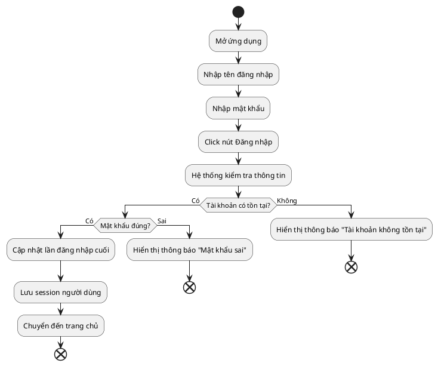
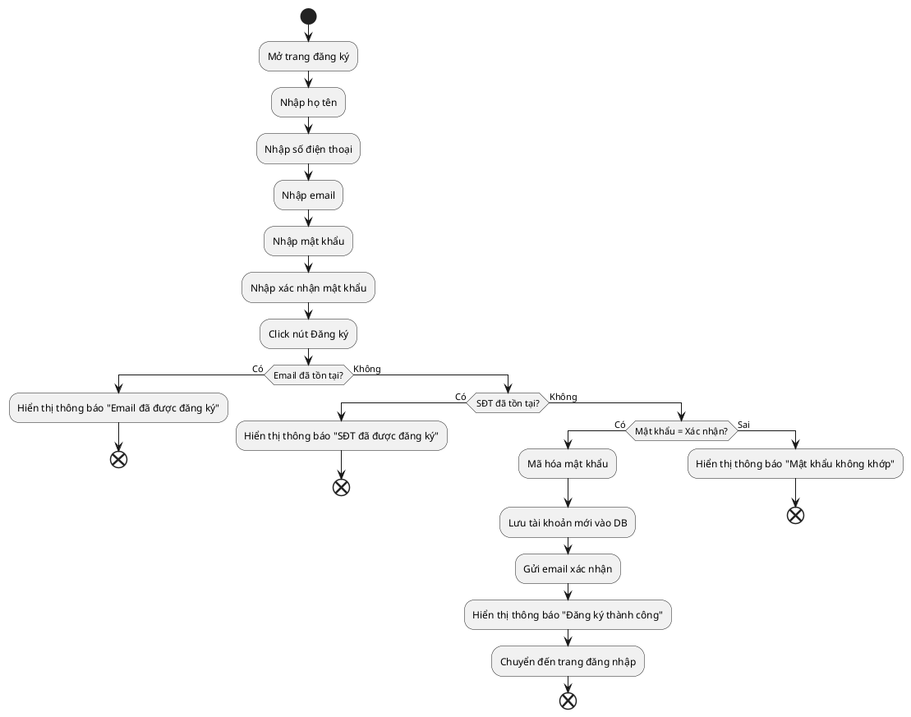
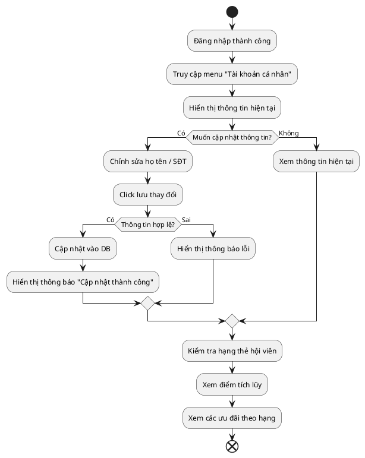
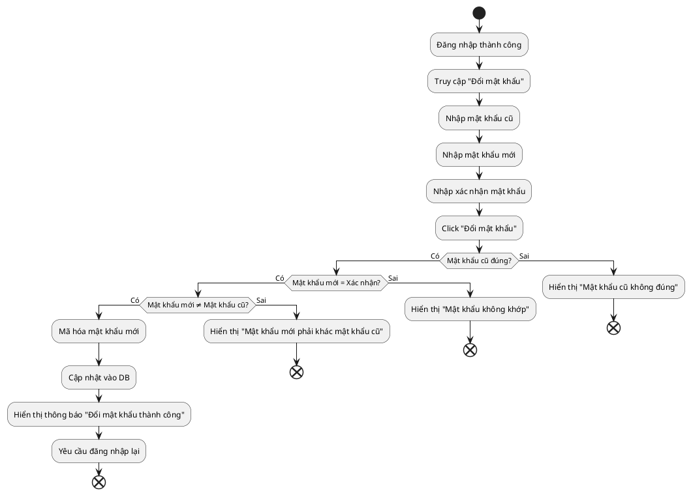

# Activity Diagram – Module 1: Tài khoản & Thành viên

## 1. Quy trình Đăng nhập (UC01)

## 2. Quy trình Đăng ký (UC02)

## 3. Quy trình Quản lý thông tin cá nhân (UC04)

## 4. Quy trình Đổi mật khẩu (UC03)

