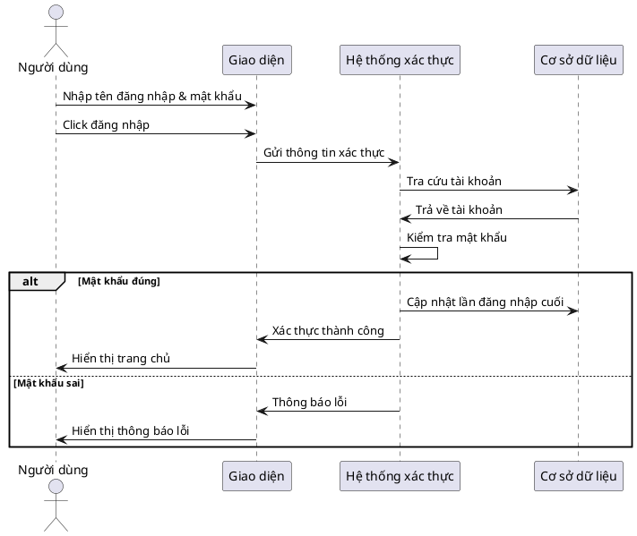
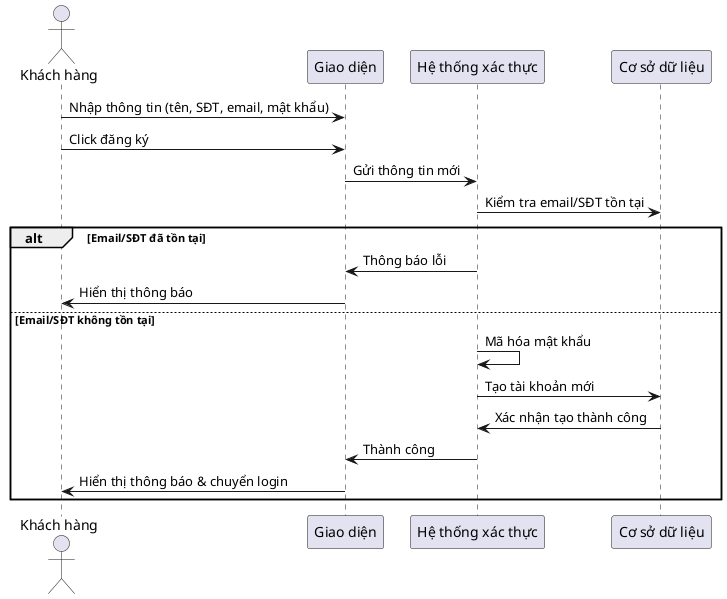
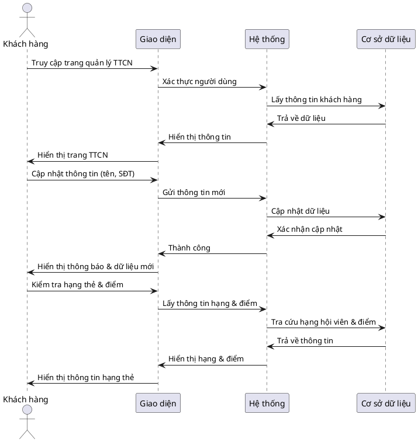

# Sequence Diagram – Module 1: Tài khoản & Thành viên

## 1. Luồng Đăng nhập (UC01)

```plantuml
@startuml
actor "Người dùng" as User
participant "Giao diện" as UI
participant "Hệ thống xác thực" as Auth
participant "Cơ sở dữ liệu" as DB

User -> UI: Nhập tên đăng nhập & mật khẩu
User -> UI: Click đăng nhập
UI -> Auth: Gửi thông tin xác thực
Auth -> DB: Tra cứu tài khoản
DB -> Auth: Trả về tài khoản
Auth -> Auth: Kiểm tra mật khẩu
alt Mật khẩu đúng
  Auth -> DB: Cập nhật lần đăng nhập cuối
  Auth -> UI: Xác thực thành công
  UI -> User: Hiển thị trang chủ
else Mật khẩu sai
  Auth -> UI: Thông báo lỗi
  UI -> User: Hiển thị thông báo lỗi
end
@enduml
```

## 2. Luồng Đăng ký (UC02)

```plantuml
@startuml
actor "Khách hàng" as Client
participant "Giao diện" as UI
participant "Hệ thống xác thực" as Auth
participant "Cơ sở dữ liệu" as DB

Client -> UI: Nhập thông tin (tên, SĐT, email, mật khẩu)
Client -> UI: Click đăng ký
UI -> Auth: Gửi thông tin mới
Auth -> DB: Kiểm tra email/SĐT tồn tại
alt Email/SĐT đã tồn tại
  Auth -> UI: Thông báo lỗi
  UI -> Client: Hiển thị thông báo
else Email/SĐT không tồn tại
  Auth -> Auth: Mã hóa mật khẩu
  Auth -> DB: Tạo tài khoản mới
  DB -> Auth: Xác nhận tạo thành công
  Auth -> UI: Thành công
  UI -> Client: Hiển thị thông báo & chuyển login
end
@enduml
```

## 3. Luồng Quản lý thông tin cá nhân (UC04)

```plantuml
@startuml
actor "Khách hàng" as Client
participant "Giao diện" as UI
participant "Hệ thống" as System
participant "Cơ sở dữ liệu" as DB

Client -> UI: Truy cập trang quản lý TTCN
UI -> System: Xác thực người dùng
System -> DB: Lấy thông tin khách hàng
DB -> System: Trả về dữ liệu
System -> UI: Hiển thị thông tin
UI -> Client: Hiển thị trang TTCN

Client -> UI: Cập nhật thông tin (tên, SĐT)
UI -> System: Gửi thông tin mới
System -> DB: Cập nhật dữ liệu
DB -> System: Xác nhận cập nhật
System -> UI: Thành công

UI -> Client: Hiển thị thông báo & dữ liệu mới
Client -> UI: Kiểm tra hạng thẻ & điểm
UI -> System: Lấy thông tin hạng & điểm
System -> DB: Tra cứu hạng hội viên & điểm
DB -> System: Trả về thông tin
System -> UI: Hiển thị hạng & điểm
UI -> Client: Hiển thị thông tin hạng thẻ
@enduml
```
