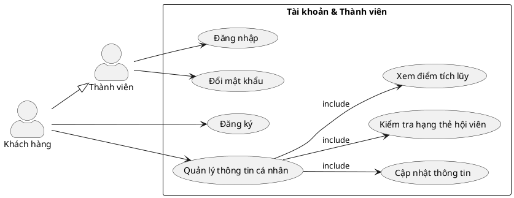

# Use Case Diagram – Module 1: Tài khoản & Thành viên

## Biểu đồ PlantUML

## Mô tả Use Case
| Use Case | Actor | Mô tả |
|----------|-------|-------|
| **UC01: Đăng nhập** | Thành viên | Xác thực tài khoản bằng tên đăng nhập/email và mật khẩu |
| **UC02: Đăng ký** | Khách hàng | Tạo tài khoản mới: họ tên, số điện thoại, email, mật khẩu |
| **UC03: Đổi mật khẩu** | Thành viên | Cập nhật mật khẩu hiện tại (xác thực mật khẩu cũ) |
| **UC04: Quản lý TTCN** | Khách hàng | Xem/cập nhật thông tin cá nhân, kiểm tra hạng thẻ và điểm |
