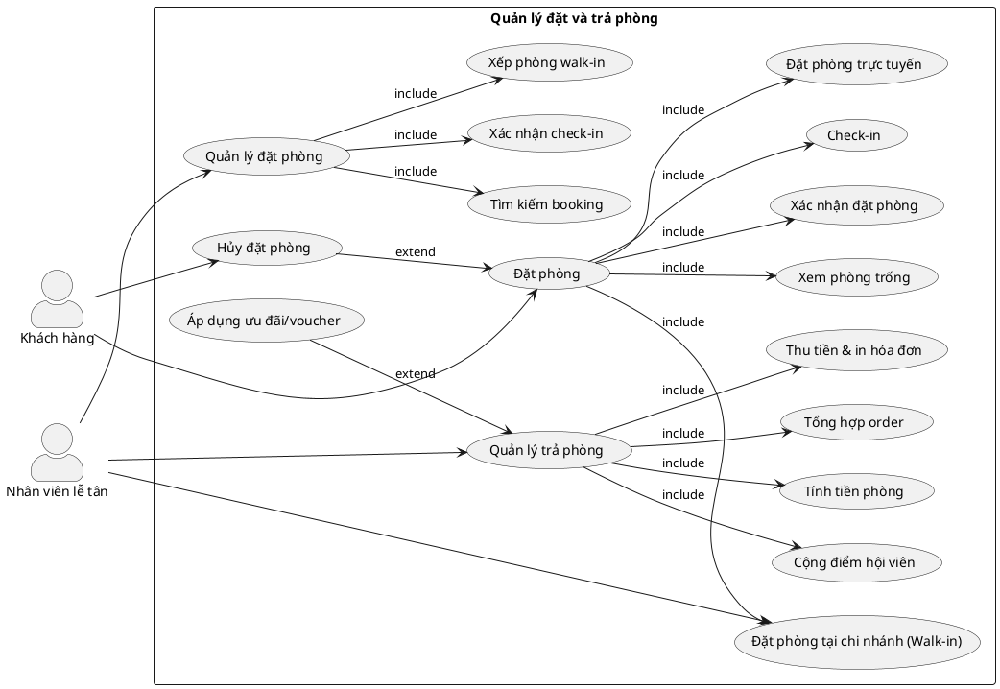

# Use Case Diagram – Module 2: Quản lý đặt và trả phòng

## Biểu đồ PlantUML

## Mô tả Use Case
| Use Case | Actor | Mô tả |
|----------|-------|-------|
| **UC05: Đặt phòng** | Khách hàng, NV Lễ tân | Đặt phòng online hoặc walk-in, xem phòng trống, xác nhận |
| **UC07: Quản lý đặt phòng** | NV Lễ tân | Tìm kiếm booking, xác nhận check-in, xếp phòng walk-in |
| **UC08: Quản lý trả phòng** | NV Lễ tân | Tính tiền, tổng hợp order, áp dụng ưu đãi, thanh toán |
